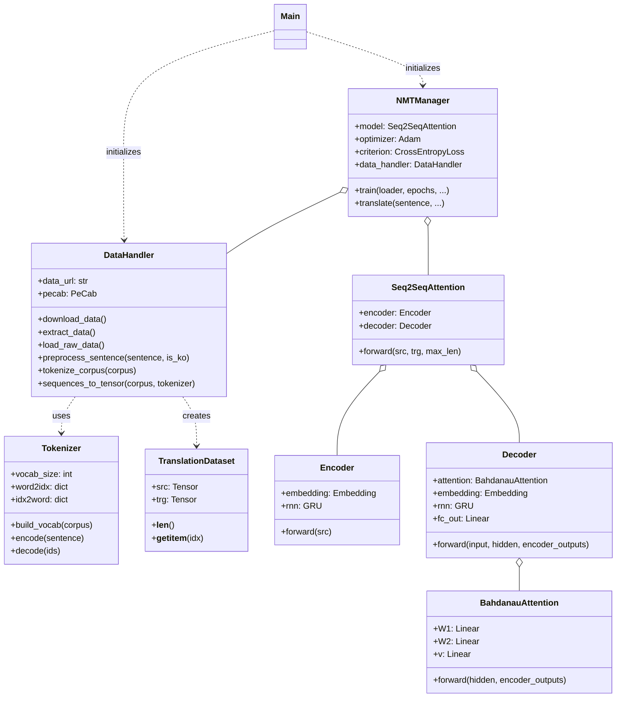

## 프로젝트: 한영 번역기 만들기 

### 1. 작업 요약 (Work Summary)

본 프로젝트는 기존의 한영 번역기 코드를 유지보수와 확장이 용이하도록 다음과 같이 개선했습니다.

*   **클래스 기반 리팩토링**:
    *   `DataHandler`: 데이터 다운로드, 전처리, 캐싱, 텐서 변환 담당
    *   `NMTManager`: 모델 학습 루프 및 번역(추론) 관리 담당
    *   `Tokenizer` & `Seq2SeqAttention`: 모듈화된 어휘 사전 및 모델 구조
*   **성능 및 효율성 개선**:
    *   **토큰화 캐싱**: `pickle`을 활용하여 전처리된 데이터를 저장함으로써 재실행 시 속도를 대폭 향상
    *   **하이퍼파라미터 관리**: `config` 딕셔너리를 도입하여 실험 설정값(학습률, 배치 크기 등)을 한곳에서 관리
    *   **실험 로그**: 학습 전 현재 설정값을 출력하도록 하여 실험 간 비교 용이성 확보
*   **실행 로직 분리 (Decoupling)**:
    *   `run_experiment(config, test_cases)`: 핵심 실험 로직을 인자 기반 함수로 분리하여 재사용성 및 실험 편의성 증대
    *   `main()`: 설정을 정의하고 `run_experiment`를 호출하는 Wrapper 역할로 단순화
*   **개발 환경 확장**:
    *   `quest_2.ipynb`: `quest.md`의 설명과 리팩토링된 코드를 결합한 Jupyter Notebook 생성 (스크립트와 동일한 `run_experiment` 구조 적용)

### 2. 향후 개선 사항 (TODO)

실험 비교 및 성능 평가의 객관성을 높이기 위해 다음 내용들을 추가로 구현할 계획입니다.

- [ ] **데이터 분석 (EDA)**: 한영 병렬 말뭉치의 문장 길이 분포 및 어휘 빈도 분석
- [ ] **실험 결과 자동 저장**: 각 실행별 `config`와 `Loss` 변화를 JSON 또는 CSV 파일로 로깅
- [ ] **모델 저장 및 불러오기 (Save/Load)**: 학습된 모델 가중치를 저장하고 필요 시 재로드하여 추론에 활용하는 기능 추가
- [ ] **성능 평가 (Evaluation)**: 테스트 데이터셋에 대한 `BLEU Score` 및 정량적 평가 로직 도입
- [ ] **시각화 (Visualization)**: Attention Weight를 활용한 번역 프로세스 **Heatmap** 시각화
- [ ] **전문 실험 관리 도구 연동**: `Weights & Biases (wandb)` 또는 `TensorBoard`를 연결하여 시각화 및 비교 분석 개선
- [ ] **성능 튜닝**: `config` 딕셔너리를 활용하여 다양한 하이퍼파라미터 조합(Grid Search 등) 실험 진행
- [ ] **모델 고도화**: Attention 메커니즘 개선(Multi-head Attention 등) 및 Transformer 모델 적용 고려

### 3. 클래스 다이어그램 (Class Diagram)

